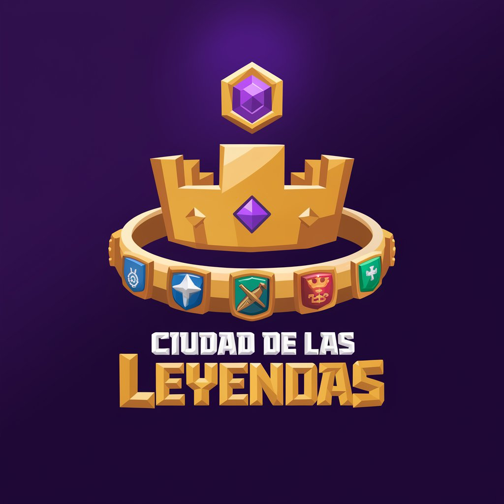

<!-- Improved compatibility of back to top link: See: https://github.com/othneildrew/Best-README-Template/pull/73 -->
<a name="readme-top"></a>
<!--
*** Thanks for checking out the Best-README-Template. If you have a suggestion
*** that would make this better, please fork the repo and create a pull request
*** or simply open an issue with the tag "enhancement".
*** Don't forget to give the project a star!
*** Thanks again! Now go create something AMAZING! :D
-->


<!-- PROJECT SHIELDS -->
<!--
*** I'm using markdown "reference style" links for readability.
*** Reference links are enclosed in brackets [ ] instead of parentheses ( ).
*** See the bottom of this document for the declaration of the reference variables
*** for contributors-url, forks-url, etc. This is an optional, concise syntax you may use.
*** https://www.markdownguide.org/basic-syntax/#reference-style-links
-->
<!-- FUTURES
[![Forks][forks-shield]][forks-url]
[![Stargazers][stars-shield]][stars-url]
[![Issues][issues-shield]][issues-url]-->


<!-- PROJECT LOGO -->
<br />
<div align="center">
  <a href="https://github.com/LaSalleGracia-Projectes/projecte-aplicaci-web-client-g8larrypage">
    
  </a>

<h3 align="center">Ciudad de las Leyendas</h3>

  <p align="center">
    Plataforma de juego que recompensa la actividad física con objetos virtuales y desafíos
    <br />
    <!-- Link to Memory PDF -->
    <a href="https://github.com/LaSalleGracia-Projectes/projecte-aplicaci-web-client-g8larrypage"><strong>Explora la documentación »</strong></a>
    <br />
    <br />
    <!-- Link to Demo Video -->
    <a href="https://github.com/LaSalleGracia-Projectes/projecte-aplicaci-web-client-g8larrypage">Ver Demo</a>
    ·
    <a href="https://github.com/LaSalleGracia-Projectes/projecte-aplicaci-web-client-g8larrypage/issues/new?labels=bug&template=bug-report---.md">Reportar Bug</a>
    ·
    <a href="https://github.com/LaSalleGracia-Projectes/projecte-aplicaci-web-client-g8larrypage/issues/new?labels=enhancement&template=feature-request---.md">Solicitar Característica</a>
  </p>
</div>

[![Contributors][contributors-shield]][contributors-url]
[![MIT License][license-shield]][license-url]

<!-- TABLE OF CONTENTS -->
<details>
  <summary>Tabla de Contenidos</summary>
  <ol>
    <li>
      <a href="#sobre-el-proyecto">Sobre el Proyecto</a>
      <ul>
        <li><a href="#construido-con">Construido Con</a></li>
      </ul>
    </li>
    <li>
      <a href="#comenzando">Comenzando</a>
      <ul>
        <li><a href="#prerrequisitos">Prerrequisitos</a></li>
        <li><a href="#instalación">Instalación</a></li>
        <li><a href="#despliegue">Despliegue</a></li>
      </ul>
    </li>
    <li><a href="#uso">Uso</a></li>
    <li><a href="#pruebas">Pruebas</a></li>
    <li><a href="#hoja-de-ruta">Hoja de Ruta</a></li>
    <li><a href="#licencia">Licencia</a></li>
    <li><a href="#agradecimientos">Agradecimientos</a></li>
  </ol>
</details>


<!-- ABOUT THE PROJECT -->
## Sobre el Proyecto

[![Captura de Pantalla del Producto][product-screenshot]](https://g8larrypage.github.io/projecte-aplicaci-web-client/)

Este proyecto es una aplicación web interactiva que gamifica la actividad física, permitiendo a los usuarios convertir sus pasos diarios en moneda virtual llamada "Pasos de Oro" para adquirir objetos, edificios y potenciadores en la tienda del juego.

Características principales:
- Sistema de autenticación con Supabase
- Tienda virtual con diferentes categorías de objetos (skins, edificios, potenciadores)
- Inventario personalizado para cada jugador
- Soporte multilenguaje (español, inglés y catalán)
- Sistema de clanes y competiciones semanales
- Construcción y expansión de ciudades
- Lucky boxes con recompensas aleatorias
- Raids y eventos especiales
- Sistema de estadísticas y clasificaciones globales
- Interfaz atractiva inspirada en juegos móviles

<p align="right">(<a href="#readme-top">volver arriba</a>)</p>

## Colaboradores
[![Contributors][contributors-shield]][contributors-url]

Grupo 8 - Larry Page

### Construido Con

* [![Next][Next.js]][Next-url]
* [![React][React.js]][React-url]
* [![Tailwind][Tailwind.css]][Tailwind-url]
* [![Supabase][Supabase]][Supabase-url]

<p align="right">(<a href="#readme-top">volver arriba</a>)</p>


<!-- GETTING STARTED -->
## Comenzando

A continuación se detallan las instrucciones para configurar el proyecto localmente.

### Prerrequisitos

* Node.js (versión 18 o superior)
* npm
  ```sh
  npm install npm@latest -g
  ```
* Cuenta en Supabase para la base de datos


### Instalación

1. Clonar el repositorio
   ```sh
   git clone https://github.com/LaSalleGracia-Projectes/projecte-aplicaci-web-client-g8larrypage.git
   ```
2. Navegar al directorio del proyecto
   ```sh
   cd projecte-aplicaci-web-client-g8larrypage
   ```
3. Instalar los paquetes NPM
   ```sh
   npm install
   ```
4. Crear un archivo `.env.local` con tus claves de Supabase
   ```
   NEXT_PUBLIC_SUPABASE_URL=tu_url_de_supabase
   NEXT_PUBLIC_SUPABASE_ANON_KEY=tu_clave_anon_de_supabase
   ```

### Despliegue
1. Iniciar el servidor de desarrollo
   ```sh
   npm run dev
   ```
2. Para producción
   ```sh
   npm run build
   npm run start
   ```

<p align="right">(<a href="#readme-top">volver arriba</a>)</p>


<!-- USAGE EXAMPLES -->
## Uso

La aplicación permite a los usuarios:

1. Registrarse y iniciar sesión
2. Ver su inventario de objetos
3. Comprar skins, edificios y potenciadores usando los pasos acumulados
4. Cambiar entre idiomas (español, inglés y catalán)

Para ver ejemplos de uso más detallados, consulta la [Documentación](https://github.com/LaSalleGracia-Projectes/projecte-aplicaci-web-client-g8larrypage)

<p align="right">(<a href="#readme-top">volver arriba</a>)</p>


## Pruebas

Para ejecutar las pruebas:

```sh
npm run test
```

<p align="right">(<a href="#readme-top">volver arriba</a>)</p>

<!-- ROADMAP -->
## Hoja de Ruta

- [X] Sistema de autenticación
- [X] Tienda virtual con inventario
- [X] Soporte multiidioma (ES, EN, CA)
- [X] Sistema de "Pasos de Oro" como moneda del juego
- [ ] Sistema de amigos y clanes
- [ ] Competiciones semanales entre clanes
- [ ] Expansión de ciudades por hitos de pasos
- [ ] Lucky boxes y recompensas exclusivas
- [ ] Integración con aplicaciones de fitness
- [ ] Raids y eventos especiales

<p align="right">(<a href="#readme-top">volver arriba</a>)</p>


<!-- LICENSE -->
## Licencia

[![MIT License][license-shield]][license-url]

Distribuido bajo la Licencia MIT. Ver `LICENSE.txt` para más información.

<p align="right">(<a href="#readme-top">volver arriba</a>)</p>


<!-- ACKNOWLEDGMENTS -->
## Agradecimientos

* [Next.js Documentation](https://nextjs.org/docs)
* [Supabase Documentation](https://supabase.com/docs)
* [Tailwind CSS](https://tailwindcss.com/)
* [React Slick](https://react-slick.neostack.com/)
* [Font Awesome](https://fontawesome.com)

<p align="right">(<a href="#readme-top">volver arriba</a>)</p>


<!-- MARKDOWN LINKS & IMAGES -->
<!-- https://www.markdownguide.org/basic-syntax/#reference-style-links -->
[contributors-shield]: https://img.shields.io/github/contributors/LaSalleGracia-Projectes/projecte-aplicaci-web-client-g8larrypage.svg?style=for-the-badge
[contributors-url]: https://github.com/LaSalleGracia-Projectes/projecte-aplicaci-web-client-g8larrypage/graphs/contributors
[license-shield]: https://img.shields.io/github/license/LaSalleGracia-Projectes/projecte-aplicaci-web-client-g8larrypage.svg?style=for-the-badge
[license-url]: https://github.com/LaSalleGracia-Projectes/projecte-aplicaci-web-client-g8larrypage/blob/main/LICENSE.txt
[product-screenshot]: public/assets/img/preview.png
[Next.js]: https://img.shields.io/badge/next.js-000000?style=for-the-badge&logo=nextdotjs&logoColor=white
[Next-url]: https://nextjs.org/
[React.js]: https://img.shields.io/badge/React-20232A?style=for-the-badge&logo=react&logoColor=61DAFB
[React-url]: https://reactjs.org/
[Tailwind.css]: https://img.shields.io/badge/Tailwind_CSS-38B2AC?style=for-the-badge&logo=tailwind-css&logoColor=white
[Tailwind-url]: https://tailwindcss.com/
[Supabase]: https://img.shields.io/badge/Supabase-3ECF8E?style=for-the-badge&logo=supabase&logoColor=white
[Supabase-url]: https://supabase.com/

